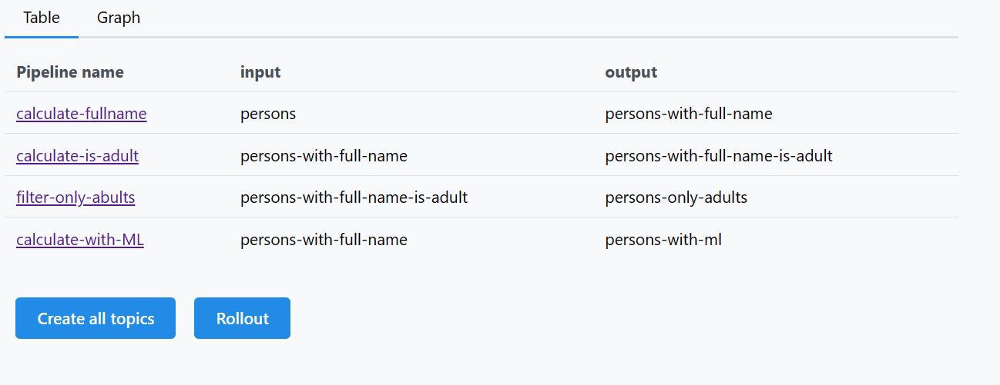
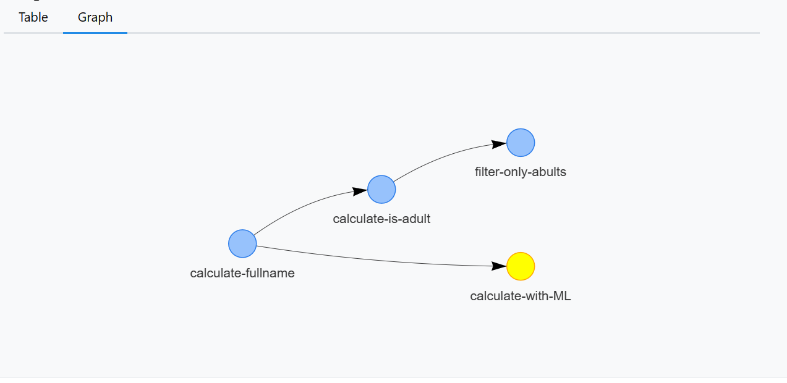

# Client

The system client provides a user-friendly interface to interact with the system and perform various tasks. It offers several functionalities to configure, manage, and monitor your pipelines effectively.

### How to run it

To run the system client locally, follow these steps:

1. Navigate to the client directory:
```
cd client
```
2. Install the necessary dependencies by running the following command:
```
npm i
```
This command will install all the required packages and dependencies for the client.

3. Once the dependencies are installed, start the client application using the following command:
```
npm start
```
This command will launch the client and open it in your default web browser.

Utilize the system client's functionality to configure, manage, and monitor your pipelines efficiently. Refer to the client documentation for detailed instructions on how to use each feature effectively.


### Pipeline Overview

With the client, you can view the configured pipelines in either a table or a graph presentation. The table view provides a concise summary of each pipeline, including its name, status, and configuration details. The graph view offers a visual representation of the pipeline dependencies and their relationships, allowing you to better understand the overall system architecture.






## Rollout Configuration

The client enables you to easily rollout new configurations for your pipelines. You can upload and apply updated pipeline configurations through the user interface. This functionality ensures a seamless deployment process, allowing you to make changes to your pipeline configurations without disrupting the system's operation.

## Pipeline Details

You can retrieve specific details about individual pipelines using the client. This includes accessing their configuration settings, such as data sources, transformations, and destinations. Additionally, you can view information about the last transferred messages, providing insights into the pipeline's data flow and status.

## Topic Creation and Testing

The client offers a convenient way to create new topics for your pipelines. You can specify the topic name, partitions, replication factor, and other configuration options through the user interface. Furthermore, you can generate test messages to validate your pipeline functionality and ensure that the data flows correctly.


Utilize the system client's functionality to configure, manage, and monitor your pipelines efficiently. Refer to the client documentation for detailed instructions on how to use each feature effectively.
