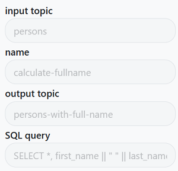
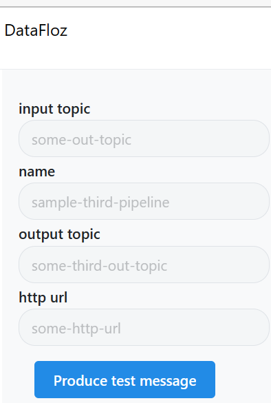
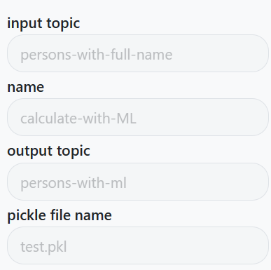
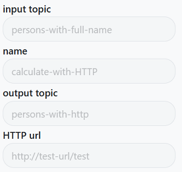

# Transformation Types

In the system, you can normalize raw data using various transformation types. Each transformation type offers a different approach to data normalization. Choose the one that best fits your requirements and data processing needs.

## SQL Transformation

The SQL transformation allows you to normalize data using SQL queries. You can write custom SQL statements to manipulate and transform the data stored in a database. This transformation type is useful when you need to perform complex data manipulations or leverage the power of SQL for data normalization.

__Parameters:__

|name     | type           | is required |
|---------|----------------|-------------|
|sql_query| string         | yes         |
|type     | string ('sql') | yes         |

## HTTP Request Transformation

The HTTP Request transformation enables you to normalize data by making HTTP requests to external services or APIs. You can fetch data from remote sources, process it, and transform it according to your needs. This transformation type is beneficial when you need to integrate with external systems or retrieve data from web services.

__Parameters:__

|name     | type           | is required | 
|---------|----------------|-------------|
|http_url | string         | yes         |
|headers  | dict           | no          |
|params   | dict           | no          |
|type     | string ('http')| yes        |

## Pickle File Transformation

The Pickle File transformation involves using a pickle file that contains a pre-trained model or function for data normalization. You can load the pickle file in your transformation pipeline and utilize the provided function or model to transform the data. This transformation type is suitable when you have a trained model or a custom data processing function that can be applied to your dataset.

__Parameters:__

|name     | type              | is required |
|---------|-------------------|-------------|
|file_name| string            | yes         |
|type     | string ('pickle') | yes         |

## Container Transformation

The Container transformation allows you to normalize data by running a containerized process that performs the required data transformation. You can build a container image with your data normalization logic, and then run the container to process the data. This transformation type offers flexibility and isolation, making it ideal for complex or specialized data normalization tasks.

__Parameters:__

|name         | type                 | is required |
|-------------|----------------------|-------------|
|container_url| string               | yes         |
|type         | string ('container') | yes         |

Select the transformation type that aligns with your data transformation needs and refer to the corresponding documentation for detailed instructions on how to utilize each transformation type effectively.
