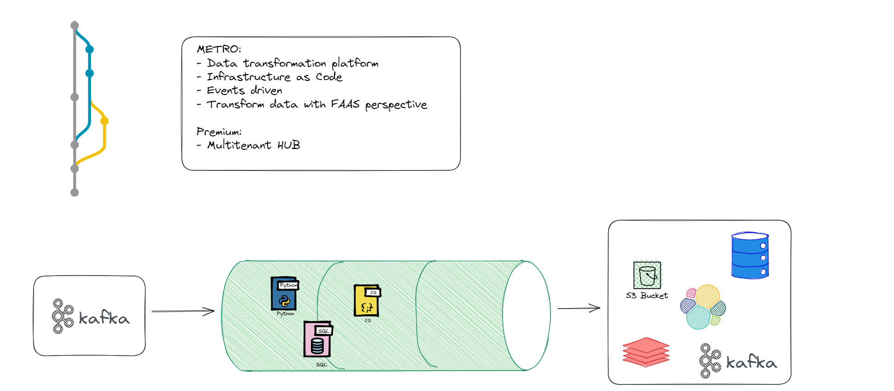
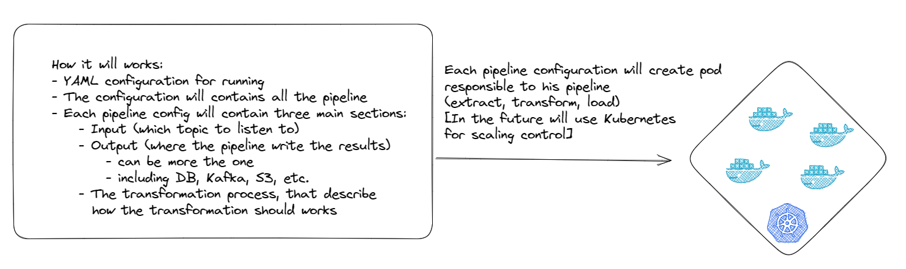

# Intro

### What Metro.IO is?
Metro is data pipelines orchestrator platform with 5 key priciples.

__The Key priciples of this pipelines platform are:__
- Infrastruction as Code
- Events driven
- KISS (Keep It Simple, Stupid!)
- Run & debug anywhere (including locally)
- Chain of Responsibility pipelines design perspective 

#### How it will work?

### Why should you try it:
As you consider potential FAAS stream solutions for your business, it's important to understand the key differentiators that set each solution apart. 

- Infrastructure as code for easy and efficient infrastructure management
- Chain of responsibility for improved reliability and reduced downtime
- Strong capabilities for real-time stream processing
- Flexible deployment options, including support for multiple cloud providers and on-premises deployment
- Built-in security features, such as encryption and access control
- Multi-cloud support for increased choice and flexibility in infrastructure deployment

 With infrastructure as code, chain of responsibility, real-time stream processing, flexible deployment options, built-in security features, and multi-cloud support, our solution can provide your business with efficient, reliable, and secure infrastructure management.

**There are several pipeline type each one use different approch to transform the data:**
- SQL (To transform data using SQL query with no efforts)
- container (To run in you own custom environment)
- HTTP (To use already existing logic within your new pipeline)
- pickle (To analyze predictions and ML capality on your data with no effor
